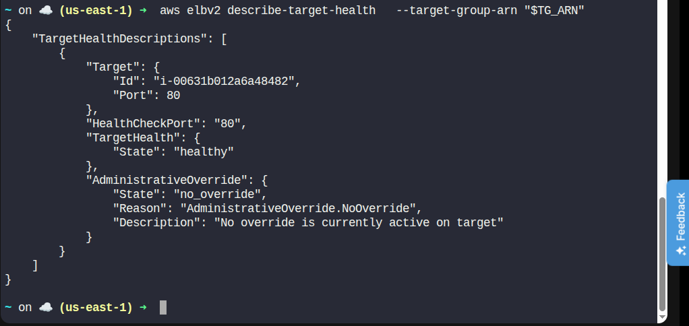
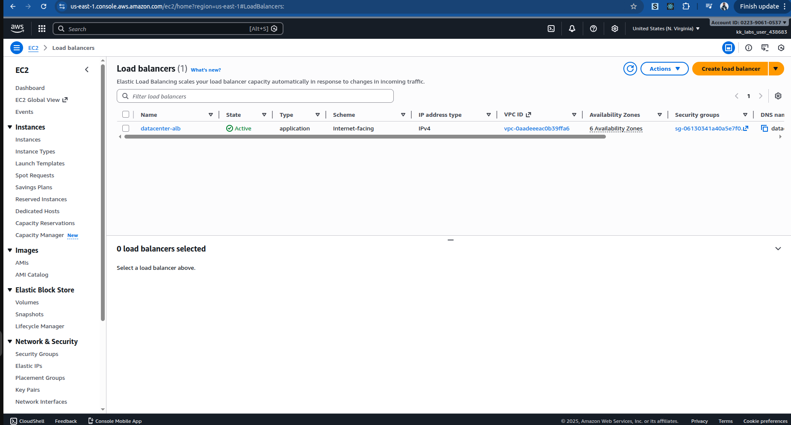
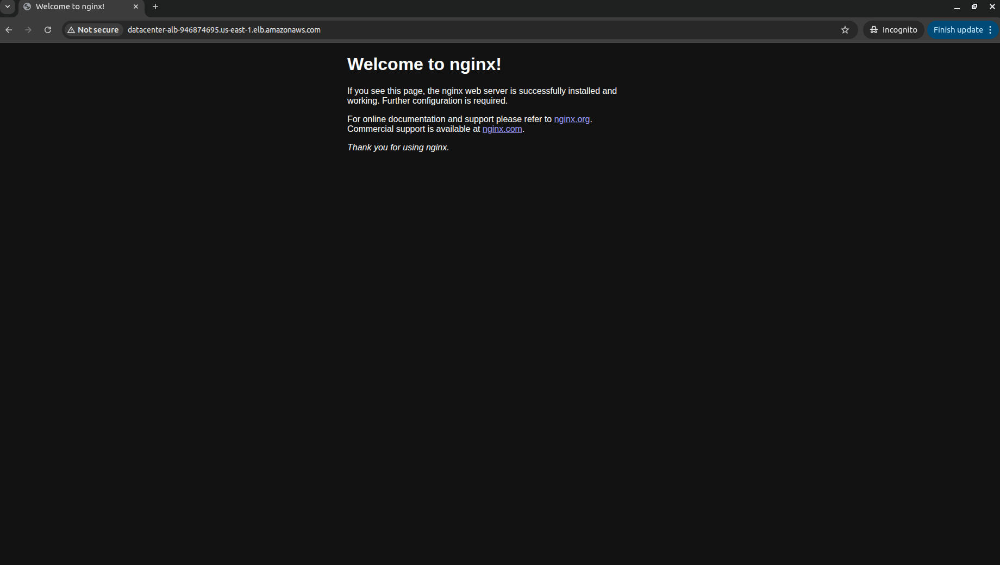

Da# Day 24 – Configure Application Load Balancer for EC2 (AWS CLI)

> You can't go back and change the beginning, but you can start where you are and change the ending.
>
> – C.S. Lewis

## Task Description

The Nautilus DevOps team is setting up a simple application architecture on AWS. An Nginx server is already running on an EC2 instance, and the team wants to place an Application Load Balancer (ALB) in front of it.

The goal is to:

- Create an Application Load Balancer to handle incoming HTTP traffic.
- Route traffic from the ALB to the EC2 instance running Nginx.
- Ensure proper security group rules are in place.
- Verify that the application is accessible via the ALB DNS name in a browser.

## Requirements

| Requirement                  | Value               |
|-----------------------------|---------------------|
| Application Load Balancer   | `datacenter-alb`    |
| Target group name           | `datacenter-tg`     |
| Security group name         | `datacenter-sg`     |
| ALB listens on port         | 80                  |
| Traffic forwarded to port   | 80                  |
| EC2 instance name           | `datacenter-ec2`    |
| Region                      | `us-east-1`         |

## Solution (Using AWS CLI)

### Step 1: Set Required Variables

```bash
REGION="us-east-1"
ALB_NAME="datacenter-alb"
TG_NAME="datacenter-tg"
ALB_SG_NAME="datacenter-sg"
EC2_NAME="datacenter-ec2"
```

### Step 2: Get VPC and Subnet Information

```bash
VPC_ID=$(aws ec2 describe-vpcs \
  --filters Name=isDefault,Values=true \
  --query "Vpcs[0].VpcId" \
  --output text)

SUBNET_IDS=$(aws ec2 describe-subnets \
  --filters Name=vpc-id,Values=$VPC_ID \
  --query "Subnets[].SubnetId" \
  --output text)
```

### Step 3: Create Security Group for ALB (Port 80 Open to Public)

```bash
ALB_SG_ID=$(aws ec2 create-security-group \
  --group-name "$ALB_SG_NAME" \
  --description "Security group for ALB" \
  --vpc-id "$VPC_ID" \
  --query "GroupId" \
  --output text)
```

Add HTTP rule:

```bash
aws ec2 authorize-security-group-ingress \
  --group-id "$ALB_SG_ID" \
  --protocol tcp \
  --port 80 \
  --cidr 0.0.0.0/0
```

### Step 4: Create the Application Load Balancer

```bash
ALB_ARN=$(aws elbv2 create-load-balancer \
  --name "$ALB_NAME" \
  --subnets $SUBNET_IDS \
  --security-groups "$ALB_SG_ID" \
  --scheme internet-facing \
  --type application \
  --query "LoadBalancers[0].LoadBalancerArn" \
  --output text)
```

### Step 5: Create Target Group

```bash
TG_ARN=$(aws elbv2 create-target-group \
  --name "$TG_NAME" \
  --protocol HTTP \
  --port 80 \
  --vpc-id "$VPC_ID" \
  --target-type instance \
  --query "TargetGroups[0].TargetGroupArn" \
  --output text)
```

### Step 6: Register EC2 Instance with Target Group

Get EC2 instance ID:

```bash
INSTANCE_ID=$(aws ec2 describe-instances \
  --filters "Name=tag:Name,Values=$EC2_NAME" \
  --query "Reservations[0].Instances[0].InstanceId" \
  --output text)
```

Register instance:

```bash
aws elbv2 register-targets \
  --target-group-arn "$TG_ARN" \
  --targets Id="$INSTANCE_ID",Port=80
```

### Step 7: Create ALB Listener (Port 80 → Target Group)

```bash
aws elbv2 create-listener \
  --load-balancer-arn "$ALB_ARN" \
  --protocol HTTP \
  --port 80 \
  --default-actions Type=forward,TargetGroupArn="$TG_ARN"
```

### Step 8: Update EC2 Security Group (If Needed)

Ensure the EC2 instance allows HTTP traffic from the ALB security group.

```bash
EC2_SG_ID=$(aws ec2 describe-instances \
  --instance-ids "$INSTANCE_ID" \
  --query "Reservations[0].Instances[0].SecurityGroups[0].GroupId" \
  --output text)

aws ec2 authorize-security-group-ingress \
  --group-id "$EC2_SG_ID" \
  --protocol tcp \
  --port 80 \
  --source-group "$ALB_SG_ID"
```

If you see `InvalidPermission.Duplicate`, the rule already exists — this is safe to ignore.

### Step 9: Verify Target Health

```bash
aws elbv2 describe-target-health \
  --target-group-arn "$TG_ARN"
```

Expected output: `State: healthy`


OR you can check on aws it might take some few minutes to provision

### Step 10: Access the Application via Browser

Get ALB DNS name:

```bash
aws elbv2 describe-load-balancers \
  --names "$ALB_NAME" \
  --query 'LoadBalancers[0].DNSName' \
  --output text
```

Open in browser:

```
http://<ALB-DNS-NAME>
```

You should see the Nginx default welcome page.


