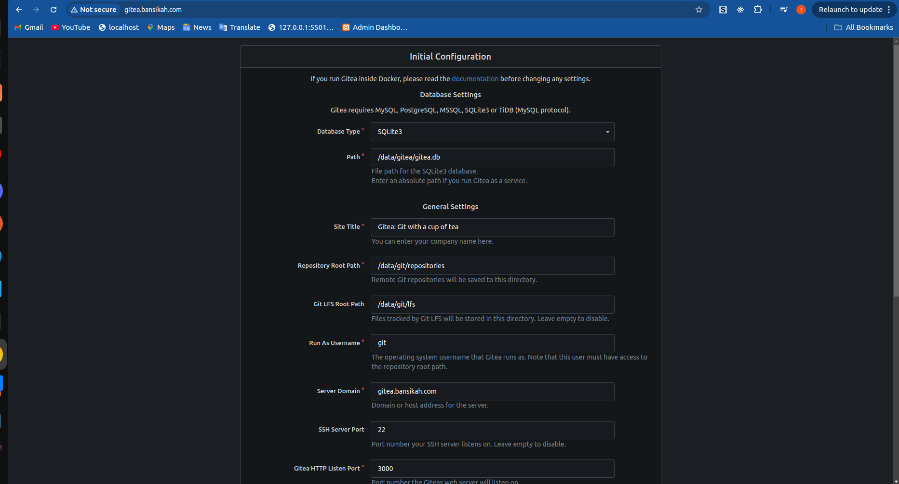
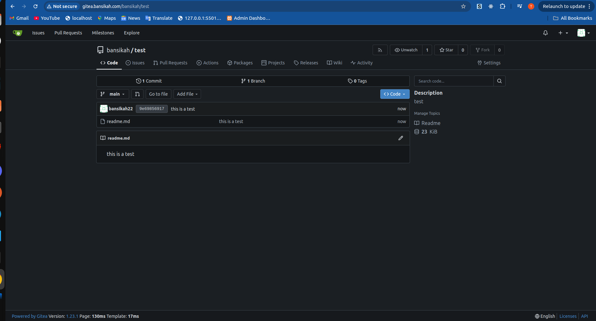

```bash
kubectl create deploy nginx --image nginx --dry-run=client -o yaml > gitea.yaml

kubectl apply -f gitea-deployment.yaml
kubectl apply -f gitea-service.yaml
kubectl apply -f gitea-ingress.yaml
kubectl apply -f gitea-pvc.yaml

##verify
kubectl get pvc
kubectl get pods


 echo "$(minikube ip) gitea.bansikah.com" | sudo tee -a /etc/hosts
```
You should see this when you access the url gitea.bansikah.com


Press install and take register to create a new account

```bash
#after installation create a new repository test and you can clone it make changes and push
git clone http://gitea.bansikah.com/bansikah/test.git
```
you should see this after modication and pushing 

