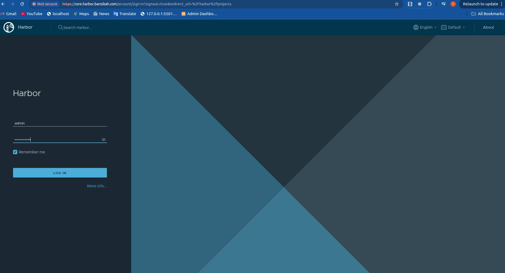
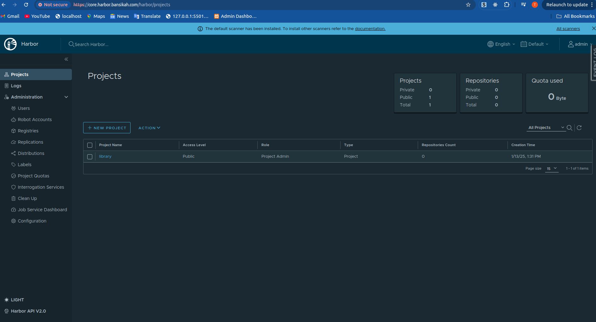
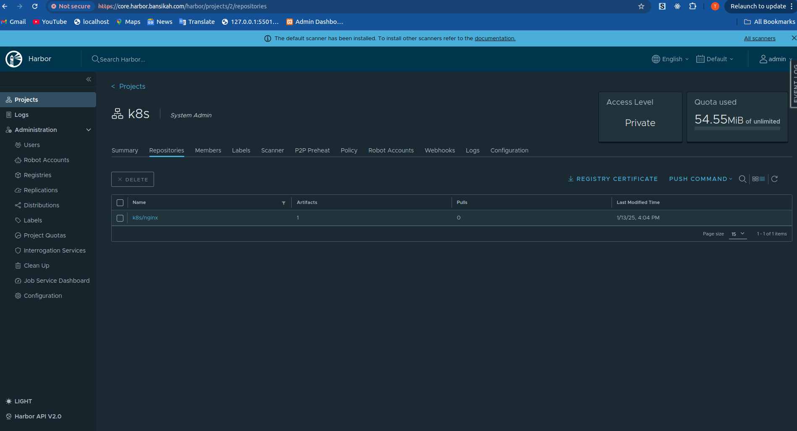
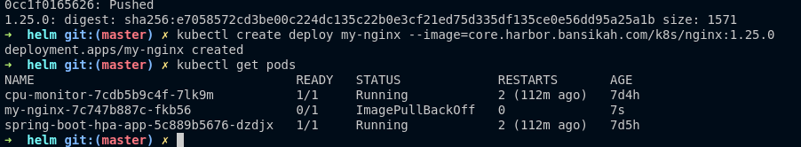

Harbor is an open-source container registry that enhances the management and security of container images. 
- It extends the capabilities of the open-source Docker Distribution by adding features such as security scanning, role-based access control, and content signing.
-  Harbor is a Cloud Native Computing Foundation (CNCF) Graduated project, ensuring compliance, performance, and interoperability across cloud-native platforms like Kubernetes and Docker. 
HARBOR

**Deploying Harbor on Minikube**

**Prerequisites:**

* **Minikube:** A tool for running Kubernetes clusters locally.
* **kubectl:** The command-line tool for interacting with the Kubernetes API server.
* **Helm:** A package manager for Kubernetes that simplifies the deployment of applications.

**Start Minikube:**

* Initialize your Minikube cluster with the desired configuration.

**Enable Ingress Add-on:**

```bash
minikube addons enable ingress
```
**Add Harbor Helm Repository: Add the official Harbor Helm chart repository:**
```bash
cd helm
helm repo add harbor https://helm.goharbor.io
helm repo update
helm repo list
```
**Configure Harbor Values: Create a `values-harbor.yaml` file to customize your Harbor deployment.**
```bash
helm install harbor harbor/harbor -f values-harbor.yaml -n harbor --create-namespace
echo "$(minikube ip) core.harbor.bansikah.com" | sudo tee -a /etc/hosts
```

**Access Harbor:**

* Navigate to https://core.harbor.bansikah.com in your web browser. 
* Log in using the default credentials:
    * Username: admin
    * Password: Harbor12345

You should see 
and the dashboard


When in the dashboard, create a new project for example k8s and press ok

For the docker login into the private registry
```bash
docker login https://core.harbor.bansikah.com/ # you will get a certificate error
# get docker to skip the certificate check since we don't have a verified certificate
# edit
vi /etc/docker/deamon.json file
## add registry name under insecure registries, you should have something like this:
{
  "insecure-registries": ["core.harbor.bansikah.com"]
}

## restart docker service
sudo systemctl restart docker
sudo systemctl status docker

## Pushing and pushing images to the registry
## pull nginx image from docker hub
docker pull nginx:1.25.0

# tag image with registry name
docker tag nginx:1.25.0 core.harbor.bansikah.com/k8s/nginx:1.25.0
docker push core.harbor.bansikah.com/k8s/nginx:1.25.0

helm upgrade harbor harbor/harbor -f values-harbor.yaml -n harbor
```
You should see this when you push the image


## Integrating k8s
```bash
kubectl create deploy my-nginx --image=core.harbor.bansikah.com/k8s/nginx:1.25.0
kubectl get pods
```
you should see this 

