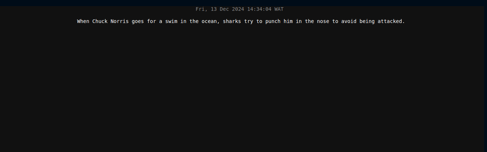

##  Chuck Norris Joke Generator - Go Application



- This is a simple Go-based application that fetches a random Chuck Norris joke from an API and displays it in a terminal-based user interface.
- The application uses the `tview` library to create a terminal-based UI and `tcell` for color support.

## Prerequisites

Before running the application, ensure you have the following installed:

- **Go** (version 1.18 or higher) - To build and run the Go application.
- **Docker** (optional) - For running the application in a containerized environment.

## Setup and Installation

1. **Clone the repository** (or copy the code):
   ```bash
   git clone https:/bansikah22/devops.git
   cd devops/learning/go/web-enables-terminal-ui
   ```
2. **Install Dependencies**
If you haven't already, run the following command to download the necessary Go dependencies:
```bash
go mod tidy
```

## Running locally
```bash
go build -o main cmd/main.go
./main
```
Build docker image
```bash
docker build -t go-app .
docker run -p 8080:8080 go-app
````

### Usage
- The application will display a new Chuck Norris joke every 14 seconds, fetched from the [Chuck Norris Joke API](https://api.chucknorris.io/jokes/random).

- The joke is displayed in the center of the terminal with a timestamp showing the current time (in gray).
You can stop the application by pressing `Ctrl+C` in the terminal.