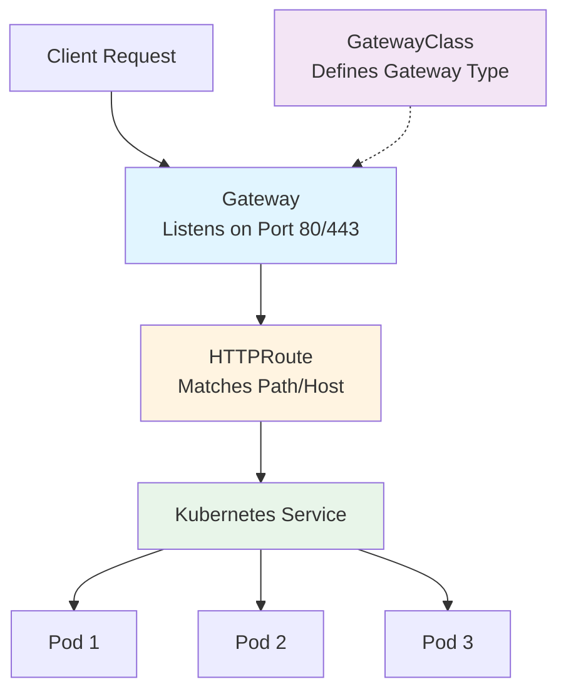

# Gateway API Basics

## What is Gateway API?

Gateway API is the next-generation API for service networking in Kubernetes. It's designed to replace and improve upon the Ingress API with better separation of concerns and more powerful routing capabilities.

## Key Components

1. **GatewayClass** - Defines a type/class of Gateway (similar to StorageClass)
2. **Gateway** - Defines network endpoints (ports, protocols) - managed by cluster operators
3. **HTTPRoute** - Defines routing rules (paths, hosts, backends) - managed by application developers

## Architecture Flow



## How It Works

1. **GatewayClass** is created by infrastructure providers (defines what type of gateway to use)
2. **Gateway** is created by cluster operators (defines where traffic enters the cluster)
3. **HTTPRoute** is created by developers (defines how to route traffic to services)
4. Traffic flows: Client → Gateway → HTTPRoute → Service → Pods

## Minikube Demo

### Prerequisites

```bash
# Start minikube
minikube start

# Enable ingress addon (for Gateway API support)
minikube addons enable ingress
```

### Step 1: Install Gateway API CRDs (REQUIRED FIRST STEP)

**IMPORTANT**: You must install the Gateway API CRDs before you can use any Gateway API resources. Without them, you'll get errors like "the server doesn't have a resource type 'httproute'".

```bash
kubectl apply -f https://github.com/kubernetes-sigs/gateway-api/releases/download/v1.0.0/standard-install.yaml

# Verify installation - you should see 4 CRDs
kubectl get crd | grep gateway

# Expected output:
# gatewayclasses.gateway.networking.k8s.io
# gateways.gateway.networking.k8s.io
# httproutes.gateway.networking.k8s.io
# referencegrants.gateway.networking.k8s.io

# Test that httproute is available (should show "No resources found" if no routes exist)
kubectl get httproute
```

### Step 2: Install a Gateway Implementation

For minikube, we'll use NGINX Gateway Fabric (or you can use Kong, Istio, etc.):

```bash
# Install NGINX Gateway Fabric
kubectl apply -f https://raw.githubusercontent.com/nginxinc/nginx-kubernetes-gateway/main/deploy/manifests/install/nginx-gateway.yaml

# Or use Kong (alternative)
# kubectl apply -f https://raw.githubusercontent.com/Kong/kubernetes-ingress-controller/main/deploy/single/all-in-one-dbless.yaml
```

### Step 3: Deploy the Demo

```bash
# Apply all resources
kubectl apply -f demo/

# Check Gateway status
kubectl get gateway

# Check HTTPRoute status

kubectl get httproute

# Get Gateway address
kubectl get gateway example-gateway -o jsonpath='{.status.addresses[0].value}'
```

### Step 4: Test the Demo

```bash
# Get the Gateway IP/address
GATEWAY_IP=$(kubectl get gateway example-gateway -o jsonpath='{.status.addresses[0].value}')

# If using minikube, you might need to use port-forward
kubectl port-forward -n nginx-gateway service/nginx-gateway 8080:80

# Test in another terminal
curl http://localhost:8080
```

### Step 5: Clean Up

```bash
kubectl delete -f demo/
```

## Quick Reference

```bash
# View all Gateway API resources
kubectl get gatewayclass
kubectl get gateway
kubectl get httproute

# Describe resources
kubectl describe gateway example-gateway
kubectl describe httproute example-route

# Check Gateway status
kubectl get gateway example-gateway -o yaml
```

## Official Documentation

- **Gateway API Official Docs**: https://gateway-api.sigs.k8s.io/
- **API Reference**: https://gateway-api.sigs.k8s.io/reference/spec/
- **Tutorials**: https://gateway-api.sigs.k8s.io/guides/
- **GitHub**: https://github.com/kubernetes-sigs/gateway-api

## Troubleshooting

### Error: "the server doesn't have a resource type 'httproute'"

This means the Gateway API CRDs are not installed. Install them first:

```bash
kubectl apply -f https://github.com/kubernetes-sigs/gateway-api/releases/download/v1.0.0/standard-install.yaml
kubectl get crd | grep gateway  # Verify installation
```

### Gateway has no address

The Gateway needs a controller implementation to be installed. Make sure you've completed Step 2 (Install a Gateway Implementation).

### HTTPRoute not routing traffic

1. Check that the HTTPRoute is attached to the Gateway:
   ```bash
   kubectl describe httproute <route-name>
   ```
2. Verify the backend service exists and has endpoints:
   ```bash
   kubectl get svc <service-name>
   kubectl get endpoints <service-name>
   ```

## Common Gateway Implementations

- **NGINX Gateway Fabric**: https://github.com/nginxinc/nginx-kubernetes-gateway
- **Kong**: https://konghq.com/kong-kubernetes-ingress-controller
- **Istio**: https://istio.io/latest/docs/tasks/traffic-management/ingress/gateway-api/
- **Contour**: https://projectcontour.io/docs/latest/guides/gateway-api/
- **Traefik**: https://doc.traefik.io/traefik/routing/providers/kubernetes-gateway/
