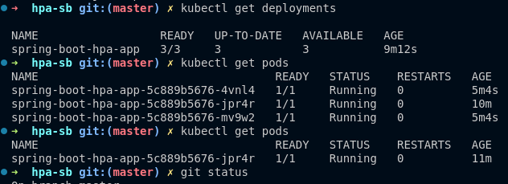
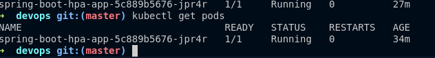

The spring boot application is develop to randomly increase cpu utilization so when ever it increases it will will scale up and vise versa.
```bash
mvn clean package

##enable metrics
minikube addons enable metrics-server


## apply files
kubectl apply -f deployment.yaml
kubectl apply -f service.yaml
kubectl apply -f hpa.yaml

## Generate load in cluster
sudo apt update
sudo apt install wrk
##for centos
sudo yum install wrk


wrk -t4 -c50 -d30s http://<minikube-ip>:<node-port>/cpu

## increase replicas
kubectl scale deployment spring-boot-app --replicas=3

#test hpa
kubectl autoscale deployment spring-boot-app --cpu-percent=50 --min=1 --max=5


## Monitor hpa
kubectl get hpa
kubectl get pods

kubectl port-forward service/spring-boot-hpa-service 8082:8082


```
**Verification**
- Confirm that new pods are created when CPU utilization exceeds 50%.
- Test scaling down by stopping the load test.



Before increasing the cpu utilization you should have this
