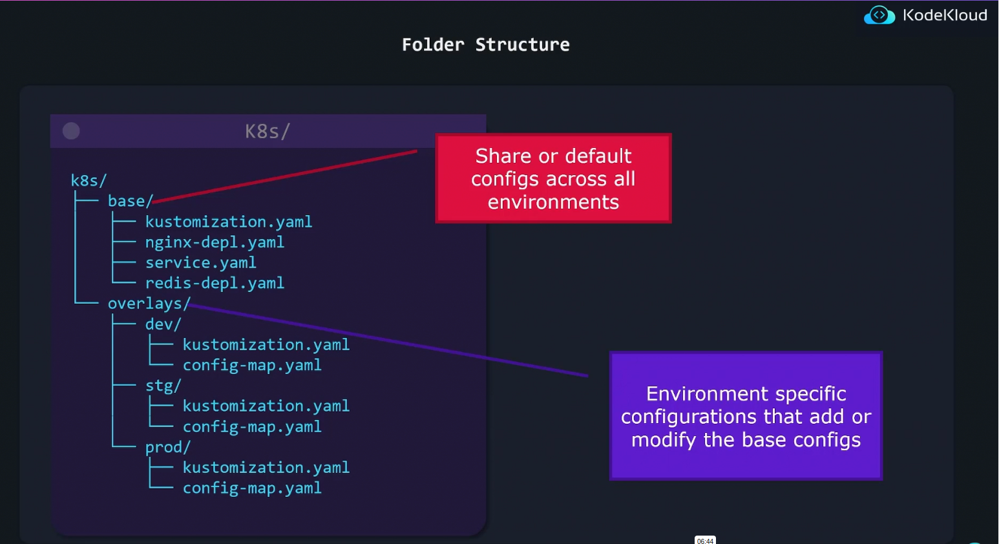

## Kustomize In Kubernetes
### Problem before kubermize was created
- The issue was with DRY(don't repetat yourself)
- Imagine having a yaml manifest file accross multiple environments, that means you will need to write seperate files for each environment(dev, prod, and staging) which is kindof time consuming and there is a lot of repetition Kustomize comes to solve that problem
- It has a base file where the configuration will be done, ut also contains default values
- `overlays` helps us to configure based on the environments

### Folder structure


So the flow is:
Base + Overlay ---> Final Manifest

- Kustomize comes with built-in kubectl so no other packages need to be installed
- But you may still want to install kustomize cli to get the latest version. Kubectl does not come with the latest version
- Does not require learning how to use any complex & hard to read templating systems(like helm)
- Everything artifact the kustomize uses is play YAML and can be validated and processed as such

### Kustomize vs Helm
- `Helm`: makes use of go templates to allow assigning variables to properties
- Helm is more that just a tool to customize  configuration on a per environment basis. Helm is also a package manager for your App
- Helm provides extra features like conditionals, loops, functions and hooks 
- Helm templates are not valid YAML as they use go templating syntax
  - Complex templates become hard to read

- `Kustomize`:


Install kustomize
```bash
 curl -s "https://raw.githubusercontent.com/kubernetes-sigs/kustomize/master/hack/install_kustomize.sh" | bash
 kustomize version --short
```

#### Execute
- kustomize build
```bash
kustomize build k8s/
```
- This command applies all what we have configured in the kustomizaation.yml file and shows us how the final output is gonna look like
- This command does not actually deploy or apply anything, so we should not that

#### Kustomize output
```bash
kustomize build k8s/ | kubectl apply -f -

## using kubectl 
kubectl apply -k k8s/
```
- The above command will actually deploy the k8s as we have specified in the kustomizaation.yml

**Delete resources using kustomize**
```bash
kustomize build k8s/ | kubectl delete -f -

## using kubectl
kubectl delete -k k8s/
```

**Kustomize apiVersion & Kind**
- Just like any other object we also have the Kustomize apiVersion for the Kustomize object

**Managing directories with kustomize**
