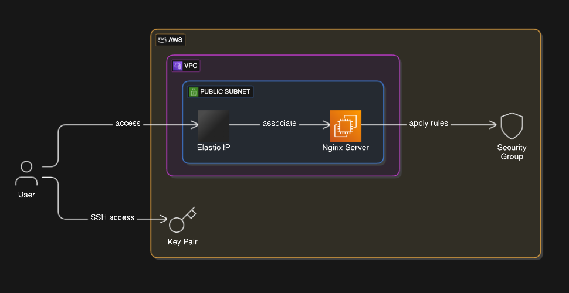

# EC2 with Nginx on it
### Technical Design Document
## Introduction
- **Purpose**: Outline the deployment of an Nginx web server on an EC2 instance using Terraform.
- **Scope**: Deployment includes EC2 instance, Elastic IP, VPC with public subnet, security group, and key pair generation.
## System Architecture
- **EC2 Instance**: Configuration and setup for hosting Nginx.
- **Elastic IP**: Association with the EC2 instance for consistent public access.
- **VPC and Subnet**: Design of VPC with a public subnet for network configuration.
- **Security Group**: Rules for inbound and outbound traffic.
- **Key Pair**: Generation and management for SSH access.
## Deployment Design
- **Terraform Configuration**: Scripts and modules for automating the deployment.
- **Resource Management**: Allocation and management of AWS resources.
## Security Considerations
- **SSH Access Restrictions**: Limiting access to specific IP addresses.
- **Firewall Rules**: Configuration of security group rules.
- **Data Encryption**: Ensuring data security in transit and at rest.
- **Security Audits**: Regular checks and updates for vulnerabilities.
## Performance Requirements
- **High Availability**: Strategies for ensuring uptime.
- **Scalability**: Ability to handle increased load.
- **Low Latency**: Optimization for fast response times.
## Testing Strategy
- **Integration Testing**: Verification of component interactions.
- **Load Testing**: Assessment of performance under stress.
## Maintenance and Support
- **Monitoring**: Tools and processes for system health checks.
- **Updates**: Procedures for applying updates and patches.
- **Support**: Contact information and escalation procedures.

Architecture
