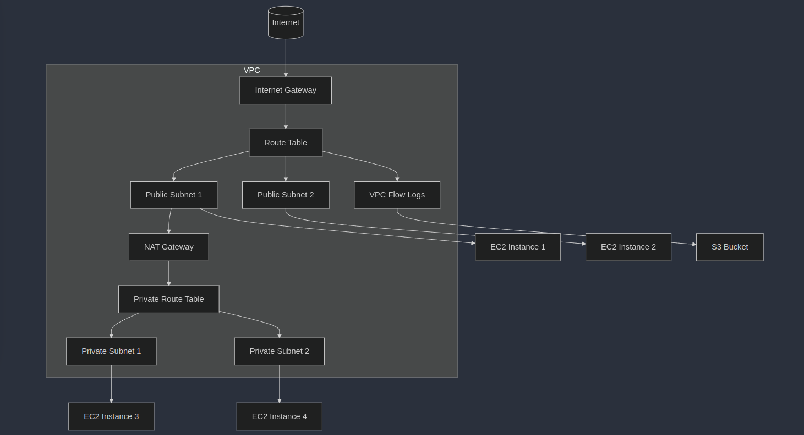

## VPC Basics
- vpc is a private network in the cloud. 
- It acts same as a gateway for local networks.
- Aws architecture -> Region -> Availability zones -> VPC(regional, spans AZs) -> Public subnets(tied to AZ, accessible from internet), private subnets(not accessible by the internet: within we have ec2 nstances) 

### Classless Inter-Domain Routing(CIDR)
- Notation for describing blocks of IP addresses

### VPC Architecture


**Diagram Explanation:**
- Internet Gateway (IGW) connects the VPC to the Internet.
- Public Subnets can communicate with the Internet directly via the IGW.
- Private Subnets communicate with the Internet through a `NAT Gateway`.
- Route Tables control the traffic flow between the subnets and the Internet.
- VPC Flow Logs monitor and log the traffic in the VPC, and logs are stored in S3.

## Virtual Private Cloud (VPC) - Brief Notes:
- A Virtual Private Cloud (VPC) is a logically isolated section of a cloud provider's infrastructure, allowing users to define a virtual network within the cloud. It provides full control over networking settings like `IP address ranges, subnets, route tables, and gateways`.

**Key Concepts:**

Subnets: Divide the VPC into smaller networks (public and private).

`Internet Gateway (IGW):` Enables Internet access for resources in public subnets.

`NAT Gateway:` Allows resources in private subnets to access the Internet securely.

`Route Tables:` Control traffic flow between subnets and the Internet.

`Security Groups & Network ACLs:` Define inbound and outbound rules for network security.

**Use Cases:**
- Hosting scalable web applications.
- Isolating and securing sensitive workloads.
- Customizable IP ranges and subnets for multi-tier architectures.

A VPC is fundamental for secure, scalable, and flexible cloud infrastructure.


### Understanding Routing in cloud
- `Regions` --> in regions we have `VPCs` --> in vpcs we have `subnets(private(10.0.48.0/20) & public(10.0.0.0/20))`
- We've also got `AZs` in VPCs
- I`nternet Gateway` is found at the VPC level for inbound and outbound traffic
- A VPC has a default reoute table, Main route table is implicitly associated with subnets that have been explicitly associated with a route table
- Main route table
-----------------------------------
Destination        | Target       |
-----------------------------------
10.0.0.0/16        | Local        |
-----------------------------------
0.0.0.0/0          |igw-id        |
-----------------------------------


- **Private route table**
-----------------------------------
Destination        | Target       |
-----------------------------------
10.0.0.0/16        | Local        |
-----------------------------------

- Each subnet can only be associated with one route table at a time
- A NAT(Network Address Translation) gateway is always in the public subnet
- In the context of AWS VPC (Virtual Private Cloud), NAT gateways are used to enable outbound internet access for instances in private subnets. Here's how NAT works in this context:
1. Instances in the private subnet send outbound traffic to the internet through the NAT gateway.
2. The NAT gateway translates the source IP address of the outbound traffic to the public IP address of the NAT gateway.
3. The NAT gateway forwards the traffic to the internet, and the response traffic is sent back to the NAT gateway
4. The NAT gateway translates the destination IP address of the response traffic back to the private IP address of the instance.
5. The instance receives the response traffic as if it were coming from the internet.

### CIDR(Classless inter-Domain Routing)
- CIDR (Classless Inter-Domain Routing) is a method used to define and allocate IP address ranges in a more flexible and scalable manner than traditional classful network addressing. It is widely used in networking and cloud computing to simplify IP address management and enable the creation of larger, more efficient networks.

- CIDR notation represents an IP address range using a combination of the network address and the network prefix length. The network prefix length specifies the number of leading bits in the IP address that are used to identify the network, while the remaining bits are used for host addresses.

- Examples
- 192.168.0.0/24: This represents a network with a network address of 192.168.0.0 and a network prefix length of 24. This means that the network consists of 256 possible host addresses (2^8), ranging from 192.168.0.1 to 192.168.0.254. The last address, 192.168.0.255, is typically reserved for the network broadcast address.

- In cloud computing, CIDR notation is used to define the IP address range for virtual networks, subnets, and other resources. By using CIDR notation, cloud providers can easily allocate and manage IP addresses across multiple regions and availability zones, ensuring scalability and fault tolerance.

- `Longest prefix` always wins, so all 172.16.0.0 traffic goes via peer 1 except traffic to 172.16.0.15 which goes viat peer 2


### Steps for creating a vpc
- This Terraform script creates a VPC with the following components:
- A VPC with the specified CIDR block.
- An Internet Gateway attached to the VPC.
- A public subnet with a route to the Internet Gateway.
- A private subnet.
- A NAT Gateway in the public subnet for the private subnet's internet access.
- Separate route tables for public and private subnets.
- Appropriate route table associations.
- A basic security group allowing SSH access.

```h
# Provider configuration
provider "aws" {
  region = "us-east-1"  # Specify your desired AWS region where the resources will be created
}

# VPC resource
resource "aws_vpc" "main" {
  cidr_block           = "10.0.0.0/16"  # The range of IP addresses for the VPC (CIDR block)
  enable_dns_hostnames = true  # Enables DNS hostnames in the VPC
  enable_dns_support   = true  # Enables DNS support for instances within the VPC

  tags = {
    Name = "my-vpc"  # Tags the VPC with a name for easier identification
  }
}

# Internet Gateway (provides access to the internet for public subnet)
resource "aws_internet_gateway" "main" {
  vpc_id = aws_vpc.main.id  # Associates the Internet Gateway with the VPC

  tags = {
    Name = "my-igw"  # Tags the Internet Gateway with a name for easier identification
  }
}

# Public subnet (allows access to the internet)
resource "aws_subnet" "public" {
  vpc_id                  = aws_vpc.main.id  # Associates the subnet with the VPC
  cidr_block              = "10.0.1.0/24"  # The IP address range for this subnet
  availability_zone       = "us-east-1a"   # Specifies the availability zone where the subnet is created
  map_public_ip_on_launch = true  # Automatically assigns a public IP to instances launched in this subnet

  tags = {
    Name = "public-subnet"  # Tags the public subnet for easier identification
  }
}

# Private subnet (cannot access the internet directly)
resource "aws_subnet" "private" {
  vpc_id            = aws_vpc.main.id  # Associates the subnet with the VPC
  cidr_block        = "10.0.2.0/24"  # The IP address range for this subnet
  availability_zone = "us-east-1b"   # Specifies the availability zone where the subnet is created

  tags = {
    Name = "private-subnet"  # Tags the private subnet for easier identification
  }
}

# NAT Gateway (allows private subnet to access the internet)
resource "aws_eip" "nat" {
  domain = "vpc"  # An Elastic IP (EIP) that will be assigned to the NAT gateway
}

resource "aws_nat_gateway" "main" {
  allocation_id = aws_eip.nat.id  # Links the EIP to the NAT gateway
  subnet_id     = aws_subnet.public.id  # Places the NAT gateway in the public subnet

  tags = {
    Name = "my-nat-gateway"  # Tags the NAT gateway for easier identification
  }
}

# Route table for public subnet
resource "aws_route_table" "public" {
  vpc_id = aws_vpc.main.id  # Associates the route table with the VPC

  route {
    cidr_block = "0.0.0.0/0"  # Route for all internet traffic
    gateway_id = aws_internet_gateway.main.id  # Sends all outbound traffic to the internet gateway
  }

  tags = {
    Name = "public-route-table"  # Tags the route table for easier identification
  }
}

# Route table for private subnet
resource "aws_route_table" "private" {
  vpc_id = aws_vpc.main.id  # Associates the route table with the VPC

  route {
    cidr_block     = "0.0.0.0/0"  # Route for all internet traffic
    nat_gateway_id = aws_nat_gateway.main.id  # Sends all outbound traffic from private subnet to the NAT gateway
  }

  tags = {
    Name = "private-route-table"  # Tags the route table for easier identification
  }
}

# Associate public subnet with public route table
resource "aws_route_table_association" "public" {
  subnet_id      = aws_subnet.public.id  # Associates the public subnet with the public route table
  route_table_id = aws_route_table.public.id  # Specifies which route table to associate with the subnet
}

# Associate private subnet with private route table
resource "aws_route_table_association" "private" {
  subnet_id      = aws_subnet.private.id  # Associates the private subnet with the private route table
  route_table_id = aws_route_table.private.id  # Specifies which route table to associate with the subnet
}

# Security Group for VPC (controls inbound and outbound traffic)
resource "aws_security_group" "main" {
  name        = "my-security-group"  # The name of the security group
  description = "Allow inbound traffic"  # Description of the security group
  vpc_id      = aws_vpc.main.id  # Associates the security group with the VPC

  # Ingress rule to allow inbound SSH traffic
  ingress {
    description = "Allow SSH"  # Description of the rule
    from_port   = 22  # Port 22 (SSH)
    to_port     = 22  # Port 22 (SSH)
    protocol    = "tcp"  # Protocol: TCP
    cidr_blocks = ["0.0.0.0/0"]  # Allows access from any IP address
  }

  # Egress rule to allow all outbound traffic
  egress {
    from_port   = 0  # Port range start
    to_port     = 0  # Port range end
    protocol    = "-1"  # "-1" means all protocols
    cidr_blocks = ["0.0.0.0/0"]  # Allows outbound traffic to any IP address
  }

  tags = {
    Name = "allow-ssh"  # Tags the security group for easier identification
  }
}

```

**To use this script:**
- Save it as main.tf in a directory.
- Run terraform init to initialize the Terraform working directory.
- Run terraform plan to see what changes will be made.
- Run terraform apply to create the VPC and its components.

### Custome Script
```h
# Provider configuration
provider "aws" {
  region = "us-east-1"  # Specify the AWS region where resources will be created
}

# VPC and networking resources (as previously defined)
# ...

# EKS Cluster definition
resource "aws_eks_cluster" "main" {
  name     = "my-eks-cluster"  # Name of the EKS cluster
  role_arn = aws_iam_role.eks_cluster_role.arn  # IAM role for the EKS cluster

  # VPC configuration for the EKS cluster
  vpc_config {
    subnet_ids = [aws_subnet.public.id, aws_subnet.private.id]  # Subnets where the cluster will be deployed
  }

  # Ensure that IAM Role permissions are created before and deleted after EKS Cluster handling
  depends_on = [aws_iam_role_policy_attachment.eks_cluster_policy]
}

# IAM Role for EKS Cluster
resource "aws_iam_role" "eks_cluster_role" {
  name = "eks-cluster-role"  # Name of the IAM role for the EKS cluster

  # Trust relationship policy allowing EKS to assume this role
  assume_role_policy = jsonencode({
    Version = "2012-10-17"
    Statement = [
      {
        Action = "sts:AssumeRole"
        Effect = "Allow"
        Principal = {
          Service = "eks.amazonaws.com"
        }
      }
    ]
  })
}

# Attach the necessary policy to the EKS cluster role
resource "aws_iam_role_policy_attachment" "eks_cluster_policy" {
  policy_arn = "arn:aws:iam::aws:policy/AmazonEKSClusterPolicy"  # AWS managed policy for EKS clusters
  role       = aws_iam_role.eks_cluster_role.name
}

# EKS Node Group: xs2a
resource "aws_eks_node_group" "xs2a" {
  cluster_name    = aws_eks_cluster.main.name  # Reference to the EKS cluster
  node_group_name = "xs2a"  # Name of the node group
  node_role_arn   = aws_iam_role.eks_node_role.arn  # IAM role for the nodes
  subnet_ids      = [aws_subnet.private.id]  # Subnet where nodes will be launched

  # Scaling configuration for the node group
  scaling_config {
    desired_size = 1
    max_size     = 1
    min_size     = 1
  }

  instance_types = ["t3.medium"]  # EC2 instance type for the nodes

  depends_on = [aws_iam_role_policy_attachment.eks_worker_node_policy]
}

# EKS Node Group: sand_box (similar configuration as xs2a)
resource "aws_eks_node_group" "sand_box" {
  # ... (similar configuration as xs2a node group)
}

# EKS Node Group: qwac (similar configuration as xs2a)
resource "aws_eks_node_group" "qwac" {
  # ... (similar configuration as xs2a node group)
}

# IAM Role for EKS Node Groups
resource "aws_iam_role" "eks_node_role" {
  name = "eks-node-role"  # Name of the IAM role for EKS nodes

  # Trust relationship policy allowing EC2 to assume this role
  assume_role_policy = jsonencode({
    Version = "2012-10-17"
    Statement = [
      {
        Action = "sts:AssumeRole"
        Effect = "Allow"
        Principal = {
          Service = "ec2.amazonaws.com"
        }
      }
    ]
  })
}

# Attach necessary policies to the EKS node role
resource "aws_iam_role_policy_attachment" "eks_worker_node_policy" {
  policy_arn = "arn:aws:iam::aws:policy/AmazonEKSWorkerNodePolicy"  # Allows EKS worker nodes to connect to EKS Clusters
  role       = aws_iam_role.eks_node_role.name
}

resource "aws_iam_role_policy_attachment" "eks_cni_policy" {
  policy_arn = "arn:aws:iam::aws:policy/AmazonEKS_CNI_Policy"  # Required for the Amazon VPC CNI Plugin
  role       = aws_iam_role.eks_node_role.name
}

resource "aws_iam_role_policy_attachment" "ecr_read_only" {
  policy_arn = "arn:aws:iam::aws:policy/AmazonEC2ContainerRegistryReadOnly"  # Allows read access to Amazon ECR
  role       = aws_iam_role.eks_node_role.name
}
```