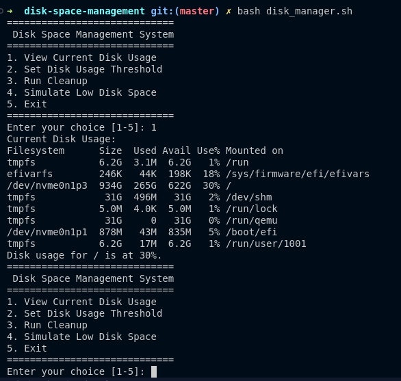

# Self-Healing Disk Space Management System

## Overview

The **Self-Healing Disk Space Management System** is a shell-based utility designed to prevent servers from crashing due to low disk space. It monitors disk usage, performs automated cleanup of unnecessary files, and provides an interactive terminal interface for administrators to manage disk space dynamically.

## Features

- **Disk Usage Monitoring**: Tracks the current disk usage and warns if it exceeds a user-defined threshold.
- **Automated Cleanup**:
  - Removes old log files.
  - Deletes temporary files.
  - Clears cache data.
- **Interactive Menu**: 
  - View disk usage.
  - Set custom disk usage thresholds.
  - Trigger cleanup manually.
  - Simulate low disk space for testing.
- **Alert System**: Sends notifications to administrators if cleanup fails to resolve the issue.
- **Logging**: Maintains a log of cleanup actions in a designated log file.

---

## Steps to Execute the Script

### 1. **Clone the Project**
   ```bash
   git clone https://github.com/basikah22/devops.git
   cd devops/shell-scripting/disk-space-management

   chmod +x disk_manager.sh

   bash disk_manager.sh
   ```

## you should see
